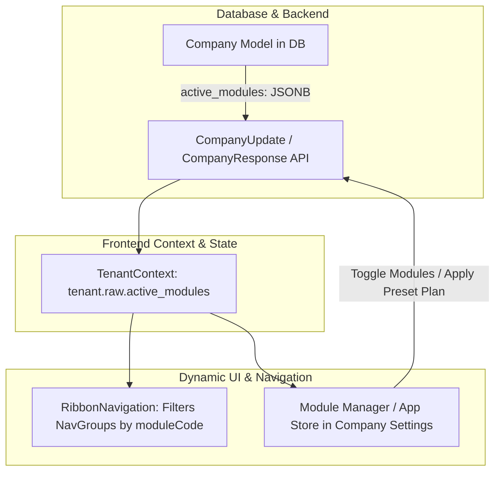

# Implementation Plan: Modular Plugin Architecture (Dynamic Feature Flags & Module Manager)

Implement a composable, modular architecture so BusinessOSAI can sell customized packages (e.g. POS + Inventory for retail clients vs. Full ERP Suite for enterprises) with instant module enable/disable capabilities.

## User Review Required

> [!IMPORTANT]
> **Zero Downtime & Safe Defaults**: Any existing company without explicit module configuration will automatically default to having all standard modules enabled, ensuring no disruption to current workflows.
> 
> **Instant Live Updates**: Toggling a module on/off in the Module Manager immediately updates the top ribbon navigation and interface in real-time without requiring a full page refresh.

---

## Architecture Design

---

## Preset Packages & Available Modules

| Module Code | Module Name | Included Features | Target Industry |
| :--- | :--- | :--- | :--- |
| `pos` | **Point of Sale (POS)** | POS Terminal, Barcode Billing, Receipts, Payment In, Shifts | Retail Stores, Supermarkets, Cafes |
| `inventory` | **Inventory & Stock** | Products, Batches, Serials, Stock Adjustments, Barcode Generator | All Businesses |
| `procurement` | **Procurement & Sourcing** | Purchase Requisitions (PR), Purchase Orders (PO), Vendor Bills (PINV), OCR | Traders, Wholesalers, Manufacturers |
| `crm` | **CRM & Sales** | Leads, Customers, Sales Pipeline, Deals, Feedback, Meta Ads | Sales Teams, B2B & B2C Services |
| `hrms` | **HRMS & Payroll** | Employee Directory, Attendance, Biometrics, Payroll, Leaves, Recruitment | Mid-to-Large Companies |
| `accounting` | **Accounting & GST** | Double-Entry General Ledger, Chart of Accounts, GST Return Filing, Vouchers | Finance & Tax Compliance |
| `reports` | **BI Analytics & Reports** | Sales Reports, Profit & Loss, Inventory Valuation, Audit Trail | Management & Executives |
| `marketplace` | **Multi-Vendor Marketplace** | Vendor Portal, Payouts, Commissions, Store Listings | Ecommerce Platforms |
| `ecommerce` | **Online Storefront** | Customer Store, Product Catalog, Online Checkout, Wishlist | Direct-to-Consumer Brands |
| `copilot` | **LazyMonkey AI CoPilot** | Natural Language Analytics, AI Invoicing, Automated Insights | Modern AI-Powered Workspaces |

### Preset Packages:
1. 🛒 **Retail Starter**: `["workspace", "pos", "inventory", "crm", "reports"]`
2. 🚚 **Wholesale & Trader Pro**: `["workspace", "pos", "inventory", "procurement", "crm", "accounting", "reports"]`
3. 🏢 **Enterprise Full Suite**: `["workspace", "erp", "inventory", "pos", "procurement", "crm", "hrms", "accounting", "reports", "marketplace", "ecommerce", "copilot"]`

---

## Proposed Changes

### Backend Database & Schemas

#### [MODIFY] [__init__.py](file:///c:/Users/abhil/Desktop/businessosai/BusinessOSAI/backend/src/models/__init__.py)
- Add `active_modules: Mapped[list | None] = mapped_column(JSONB, default=list)` to `Company` model.

#### [MODIFY] [schemas/erp.py](file:///c:/Users/abhil/Desktop/businessosai/BusinessOSAI/backend/src/schemas/erp.py)
- Add `active_modules: list[str] | None = None` to `CompanyCreate`, `CompanyUpdate`, and `CompanyResponse`.

#### [MODIFY] [api/v1/erp/organization.py](file:///c:/Users/abhil/Desktop/businessosai/BusinessOSAI/backend/src/api/v1/erp/organization.py)
- Ensure `update_company` handles updating `active_modules` and persists to `Company`.

---

### Frontend Navigation & State Management

#### [MODIFY] [lib/api-client.ts](file:///c:/Users/abhil/Desktop/businessosai/BusinessOSAI/frontend/src/lib/api-client.ts)
- Update `Company` interface to include `active_modules?: string[]`.

#### [MODIFY] [data/navigation.ts](file:///c:/Users/abhil/Desktop/businessosai/BusinessOSAI/frontend/src/data/navigation.ts)
- Add `moduleCode?: string;` to `NavGroup` definition.
- Tag each group with its respective `moduleCode` (`"pos"`, `"inventory"`, `"procurement"`, `"crm"`, `"hrms"`, `"accounting"`, `"reports"`, `"erp"`).

#### [MODIFY] [components/layout/ribbon-navigation.tsx](file:///c:/Users/abhil/Desktop/businessosai/BusinessOSAI/frontend/src/components/layout/ribbon-navigation.tsx)
- Check `tenant.raw.active_modules`.
- If configured, filter out navigation groups whose `moduleCode` is not in `active_modules` (while always preserving `"workspace"` and `"erp"` settings).

---

### In-App Module Manager UI (App Store)

#### [MODIFY] [components/erp/CompanyManagement.tsx](file:///c:/Users/abhil/Desktop/businessosai/BusinessOSAI/frontend/src/components/erp/CompanyManagement.tsx)
- Add a dedicated **"Installed Modules & Subscriptions"** tab / section in Company Management.
- Provide:
  - Preset Plan Quick-Selector buttons (Retail Starter, Wholesale Pro, Enterprise Suite).
  - Visual module cards with icons, category tags, badges, and toggle switches.
  - "Save & Apply Changes" action that calls `companiesApi.update` and refreshes the tenant context.

---

## Verification Plan

### Automated Build Verification
- Execute `npm run build` in `frontend/` to ensure zero TypeScript or bundling errors.

### Manual Verification Flows
1. **Default All-Modules Check**: Log in as standard company -> verify all tabs (POS, Inventory, Procurement, CRM, HRMS, Accounting) appear.
2. **Apply Retail Starter Plan**: Open Module Manager -> select "Retail Starter" (POS + Inventory + CRM) -> Click Save.
   - Verify top ribbon instantly removes HRMS and Accounting tabs.
3. **Toggle Add-on Module**: Turn ON "HRMS & Payroll" switch -> Click Save -> Verify HRMS immediately reappears in the ribbon.
